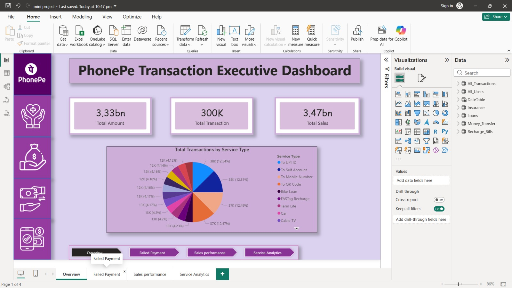
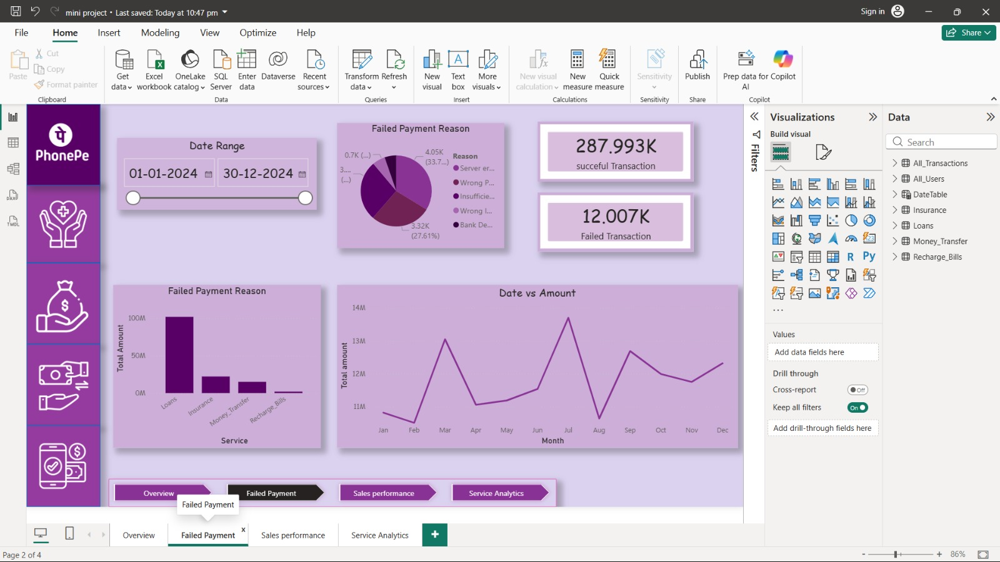
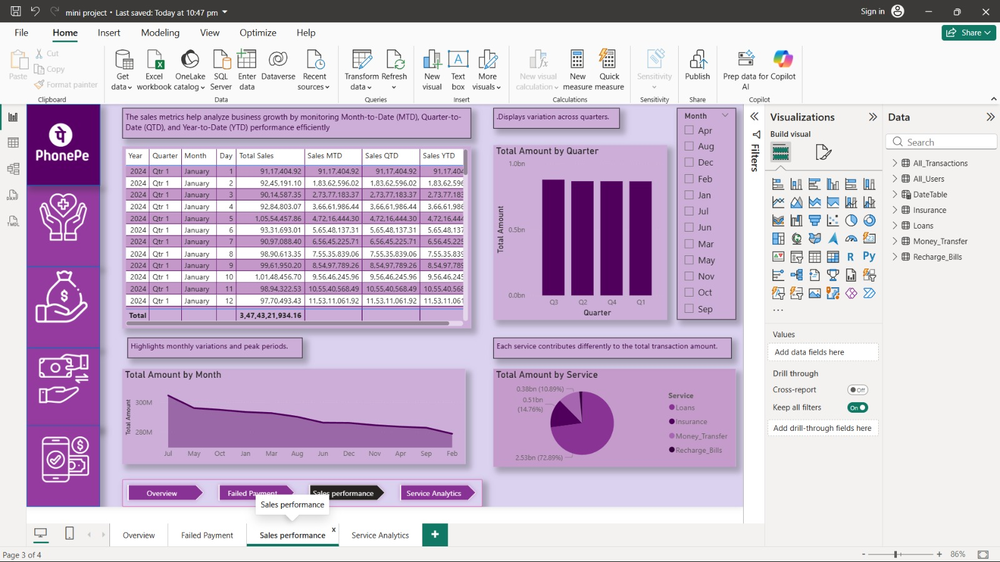
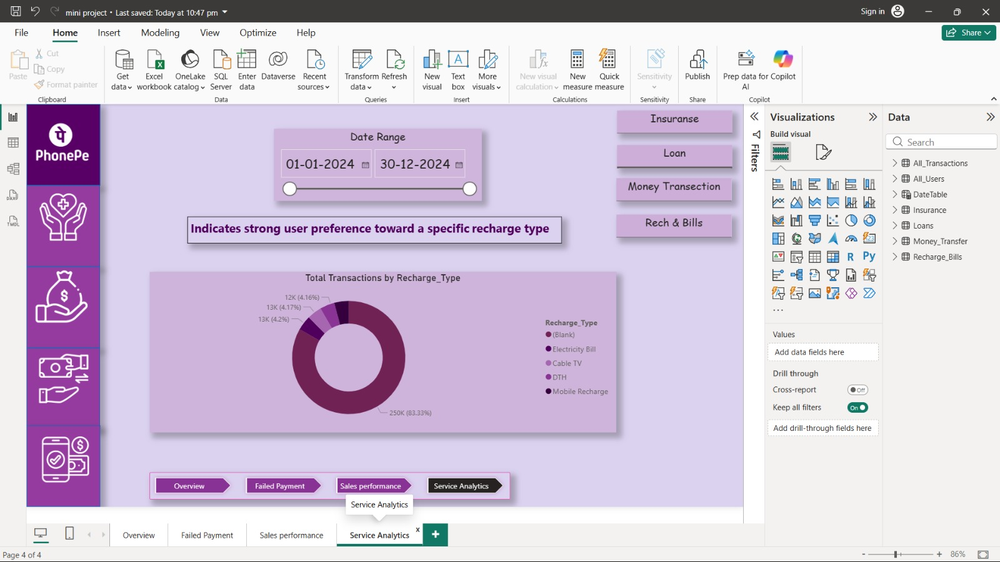

# 📊 Data Visualization Project

## 📌 Project Overview
This project is an interactive Power BI dashboard developed to analyze and visualize data using charts, KPIs, and filters. It helps users identify trends, compare metrics, and gain valuable insights for better decision-making.

## 🚀 Features
- Interactive Dashboard
- KPI Cards
- Charts and Graphs
- Filters & Slicers
- Trend Analysis
- Data Insights

## 🛠️ Tools & Technologies
- Microsoft Power BI
- Power Query
- DAX
- Microsoft Excel

## 📷 Dashboard
https://app.powerbi.com/links/gf_nTVkBNL?ctid=7e394fc8-4b86-4cfe-810e-43f86f8bec47&pbi_source=linkShare

## 📷 Dashboard Preview

### Overview

### Failed Payment

### Sales Performance

### Service Analytics

## 👩‍💻 Author
**Aarya Deowar**
